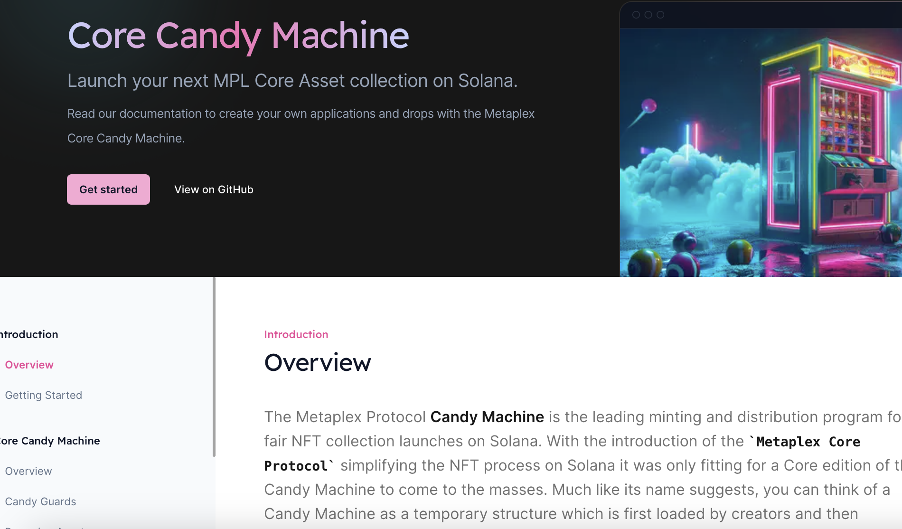

### Step0 Use case

The main use cases for the Metaplex Protocol Candy Machine are as follows:

#### 1 Minting NFT Collections

Efficiently and fairly mint digital art and game items.

#### 2 Automating NFT Sales

Manage fair pricing, oversee sales, and distribute NFTs in real-time.

#### 3 Providing a Fair Sales Environment

Ensure a fair NFT purchasing experience with bot protection and randomized allocation.

umi is a basic function when we use metaplex.

### Step1 create a umi

use createUmi from @metaplex-foundation/umi-bundle-defaults

### Step2 get a wallet file

1.fs.readFileSync
2.JSON.parse

### Step3 get a key pair

1.umi.eddsa.createKeypairFromSecretKey
2.new Uint8Array

### Step4 Set to umi

1.umi.use
2.keypairIdentity from @metaplex-foundation/umi
3.mplCandyMachine

### Step5 Create a signer and publickey about collection

1.generateSigner
2.publickey (we use 8Y9KBabGJTNKbYn9mk1TmET4BkbiKWhuZrXYR4B9vPvE)

### Step5 Create a transaction

1.use create from mpl-core-candy-machine
2.parameters
1)candyMachine
2)collection
3)collectionUpdateAuthority
4)itemAvailable
5)ConfigLineSettings
5-1)prefixName: "Example Asset #"(15 characters)
5-2)nameLength
5-3)prefixUi: "https://example.com/metadata/"(29 characters)
5-4)uriLength
5-5)isSequential
